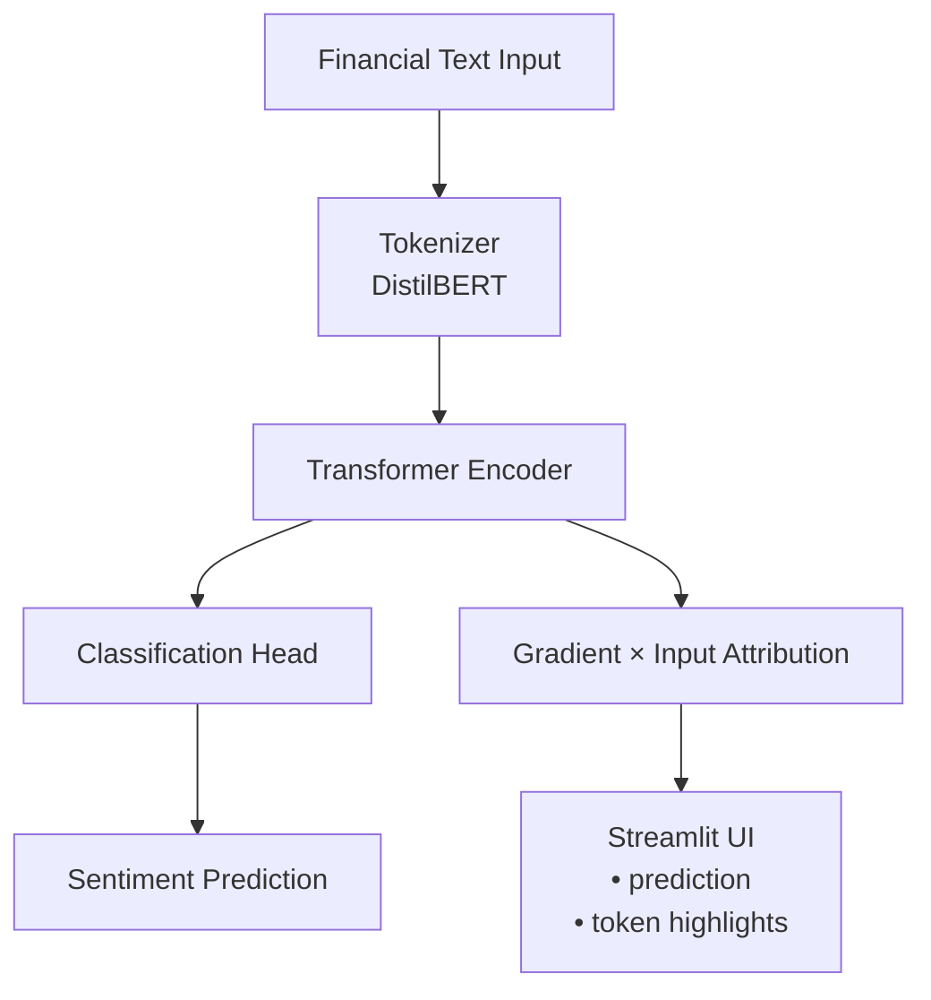

# Financial Sentiment Analysis with Explainability (XAI)

A domain specific NLP system for **financial sentiment analysis** with
**token-level explainability** using gradient-based attribution.

The system predicts sentiment from financial text and explains *why*
a prediction was made by highlighting influential words.
It is designed as an interpretable ML system with a strong focus on
correctness, transparency, and debuggability.

---

## Key Features

- Financial sentiment classification (Positive / Neutral / Negative)
- Fine-tuned DistilBERT model
- Gradient × Input token-level explanations
- Human-interpretable word importance scores
- Interactive Streamlit UI for exploration
- Fully local training and inference (no paid APIs)
- Designed for explainability, not black-box predictions

---

## Architecture Overview



---

## Example Predictions

### Positive Sentiment

**Input**
```
The company reported strong profit growth this quarter.
```

**Prediction**
```
Positive
```

**Influential Tokens**
```
reported, growth, strong
```

---

### Dataset bias ('increase' is associated with Positive class)

**Input**
```
New regulatory requirements may increase compliance costs.
```

**Prediction**
```
Positive
```

**Influential Tokens**
```
increase, costs
```

---

## How to Run

```bash
python -m venv venv
source venv/bin/activate
pip install -r requirements.txt
python -m src.train
streamlit run app/ui.py
```

---

## Design Philosophy

- Interpretability is a first-class requirement
- Prefer simple, faithful explanations over complex heuristics
- Avoid attention-based explanations
- Use gradients directly from the trained model
- Build systems that can be inspected and debugged

---

## License

MIT
